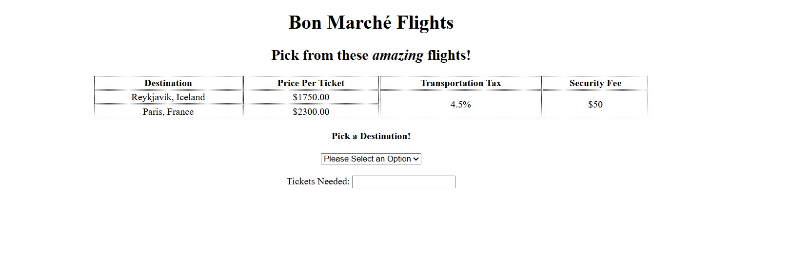
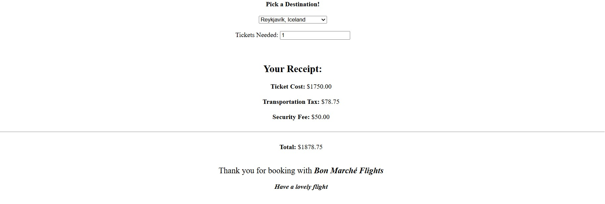

<h1>Bon Marché Flights</h1>


<h2>Description</h2>
<p>Project consists of two flight choices that let's users pick a destination and tickets to display ticket costs, additional fee, tax costs and total ticket cost</p>
<br />


<h2>Languages and Utilities Used</h2>

- <b>HTML</b>
- <b>CSS</b> 
- <b>JavaScript</b>
- <b>Visual Studio Code</b>

<h2>Environments Used </h2>

- <b>Windows 11</b>

<h2>Program Walkthrough:</h2>


<h3>The beginning of your adventure starts here!</h3> <br/>
<p>The following image shows the start of Bon Marché Flights. The user is given the option to choose between two locations Reykjavík, Iceland & Paris, France. Once the desination is selected the user will need to enter the ticket amount</p>

<br />

<p>The following image shows the start of Bon Marché Flights after a user enters the required information. In this screenshot I wanted to travel to Reykjavík, Iceland and only needed one ticket. After enter the destination and tickets needed the costs will be displayed</p>

<br />


<!--
 ```diff
- text in red
+ text in green
! text in orange
# text in gray
@@ text in purple (and bold)@@
```</h1>
